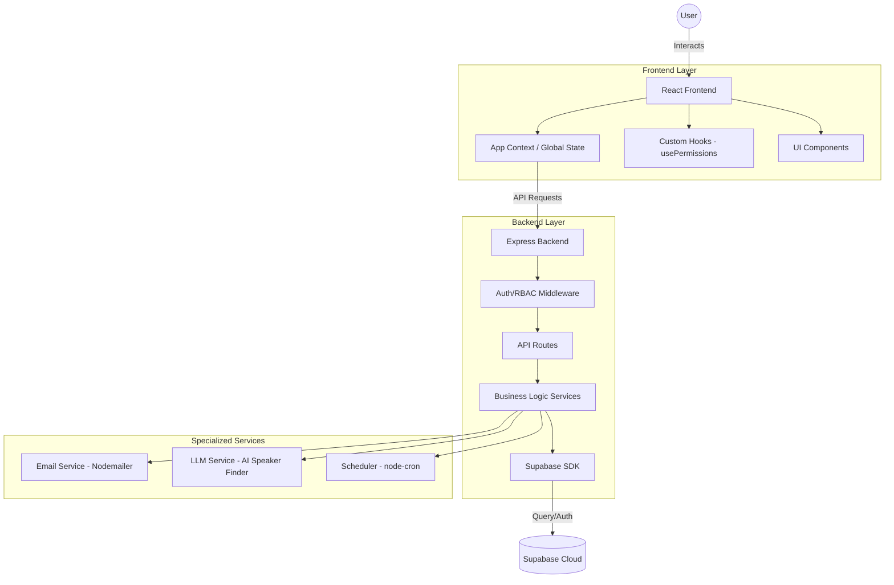

# Architecture Documentation

## Overview
ConfManager is a full-stack enterprise-grade conference management platform. It features a modern React-based frontend, a robust Node.js/Express backend, and seamless integration with Supabase for data persistence and authentication.

## Technology Stack

### Frontend
- **React 18.2** - UI Library
- **Tailwind CSS 3.3** - Utility-first styling
- **Framer Motion** - High-fidelity animations
- **Lucide React** - Icon system
- **Axios** - API communication
- **jsPDF** - Client-side certificate generation

### Backend & API
- **Node.js & Express** - Server runtime and framework
- **Supabase JS** - Database ORM and Service integration
- **Nodemailer** - Professional email automation
- **Node-cron & Vercel Crons** - Scheduled background tasks
- **Multer** - Multipart/form-data handling for paper submissions

### Data Layer
- **Supabase (PostgreSQL)** - Relational database
- **Supabase Auth** - Secure identity management
- **Supabase Storage** - File storage for papers and assets

---

## Application Flow

---

## Directory Structure
- **`/src`**: Frontend React application.
    - **`/components`**: UI modules (Auth, Dashboard, Conference).
    - **`/context`**: Global state management (AppContext).
    - **`/hooks`**: Custom React hooks (e.g., `usePermissions`).
- **`/server`**: Backend implementation.
    - **`/routes`**: API endpoints (Auth, Emails, Papers, etc.).
    - **`/services`**: Core business logic modules.
    - **`/middleware`**: Request interceptors (Authentication).
- **`/api`**: Vercel-specific API entry points.
- **`/testing`**: Comprehensive Python-based testing suite.

---

## Backend Architecture

The backend is structured into modular layers to ensure scalability and maintainability.

### 1. API Entry Point
**Location**: `api/index.mjs`
The server initializes and mounts all route handlers. It handles CORS, JSON parsing, and environment configuration. In production (Vercel), it acts as the primary serverless function entry.

### 2. Routes (`server/routes/`)
- **auth.mjs**: User registration and login flows.
- **conferences.mjs**: CRUD operations for conference entities.
- **dashboards.mjs**: Aggregated data for role-specific dashboards.
- **email.mjs**: Endpoints for triggering manual and automated emails.
- **papers.mjs**: Submission and review workflow management.
- **schedule.mjs**: Conference session scheduling and timeline management.
- **speakers.mjs**: Speaker profile management and discovery.
- **teams.mjs**: Collaborative management tools for organizers.

### 3. Middleware (`server/middleware/`)
- **authMiddleware.mjs**: Verifies JWT tokens from headers, extracts user identity, and ensures requests are authenticated before reaching business logic.

---

## Frontend Logic & State

### 1. State Management
The application uses the **React Context API** (`AppContext.jsx`) to manage:
- User sessions and profile data.
- Global loading states.
- Cached conference and paper data.

### 2. Role-Based Access Control (RBAC)
The `usePermissions` hook provides a centralized way to check user roles (Organizer, Reviewer, Presenter, Attendee) and conditionally render UI elements or restrict access to specific dashboard features.

---

## Testing Infrastructure

ConfManager maintains a high-quality codebase through an extensive **Python-based testing suite** located in the `/testing` directory.

### 1. Automated Test Categories
- **Security Tests**: Validate login flows (`security_tc_01`), RBAC enforcement (`security_tc_04`), SQL injection prevention, and XSS protection.
- **Performance Tests**: Benchmark API submission speeds, dashboard load times, and large file upload performance.
- **Functional API Tests**: Individual test scripts for every API module (Auth, Conferences, Email, Papers, etc.).
- **Reliability Tests**: Ensure database integrity and system availability.

### 2. Technology
- **Pytest**: Primary testing framework.
- **Python-Requests**: For API interaction simulation.

---

## Security Considerations

1. **Authentication**: Powered by Supabase Auth with JWT-based session management.
2. **RBAC**: Multi-layered enforcement. Frontend components are restricted via `usePermissions`, while backend routes are protected via roles stored in the database and verified in middleware.
3. **Data Protection**: Sensitive keys and credentials are stored in environment variables (`.env`).
4. **Input Sanitization**: Built-in protections against common web vulnerabilities (XSS, SQLi, CSRF).

---

## Deployment & Scalability

### 1. Vercel Integration
The platform is optimized for Vercel deployment:
- **Serverless Functions**: The Express backend is bridged to Vercel's serverless environment via `vercel.json` rewrites.
- **Cron Jobs**: Automated email processing is scheduled via native Vercel CRON paths (e.g., `/api/cron/process-emails`).

### 2. Infrastructure
- **PostgreSQL**: Managed via Supabase for high availability.
- **Storage**: Scalable file storage for conference papers and reviewer feedback artifacts.
